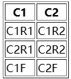
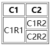
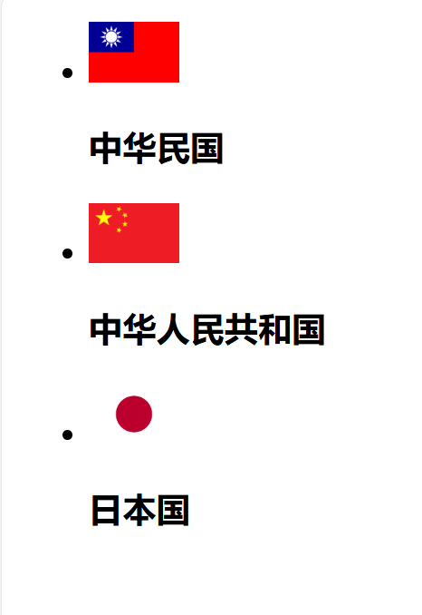

# **HTML学习笔记**

### HTML基本骨架


| 标签  | 说明               |
| ----- | ------------------ |
| html  | 定义整个html文档   |
| head  | 定义元文件等信息   |
| body  | 定义整个文档的主体 |
| title | 设置文档标题       |

```html
<!DOCTYPE html>
<html lang="en">
<head>
    <meta charset="UTF-8">
    <meta name="viewport" content="width=device-width, initial-scale=1.0">
    <title>a_title</title>
</head>
<body>

</body>
</html>
```

## 文本标签

### 标签的写法

```html
<p>中间内容</p>
<h1>中间内容</h1>
```


| 标签   | 说明                     |
| ------ | ------------------------ |
| p      | 段落                     |
| h1     | 一级标题，最重要的标题   |
| h2     | 二级标题                 |
| ..h6   | 六级标题，最不重要的标题 |
| strong | 加粗                     |
| em     | 倾斜                     |
| i      | 倾斜                     |
| ins    | 下划线                   |
| u      | 下划线                   |
| del    | 删除线                   |
| s      | 删除线                   |

> 可以使用/br标签进行换行

## 图片

图像属性


| 标签         | 说明             |
| ------------ | ---------------- |
| alt          | 不显示图片时说明 |
| title        | 鼠标触摸后的说明 |
| width/height | 定义长宽         |

## 表格

### 表格基础语法

#### 语法

表格为`table`标签，行为`tr`(tablerow)标签，每行可包含多个由`td`(tabledata)标签定义的单元格,单元格可包含文本，图片，视频，表格，列表等元素。

表格头可使用`thead`标签定义，表格尾可使用`tfoot`标签定义。

#### 示例

```html
<table border="1"> 
    <thead>
        <tr>
            <th>C1</th>
            <th>C2</th>
        </tr>
    </thead>
    <tbody>
        <tr>
            <td>C1R1</td>
            <td>C1R2</td>
        </tr>
        <tr>
            <td>C2R1</td>
            <td>C2R2</td>
        </tr>
    </tbody>
    <tfoot>
        <tr>
            <td>C1F</td>
            <td>C2F</td>
        </tr>
    </tfoot>
</table>
```

> border:边框厚度

#### 效果



## 表格合并

#### 语法

`rowspan`属性设定单元高度(最上优先) 
`colspan`属性设定单元宽度(最左优先)

#### 示例

```html
<table border="1"> 
    <tbody>
        <tr>
            <td rowspan="2">C1R1</td>
            <td>C1R2</td>
        </tr>
        <tr>
            <td>C2R2</td>
        </tr>
    </tbody>
</table>
```

#### 效果



## HTML中的相对路径

### 1. 相对路径的基本概念

- 相对路径是指相对于当前文件位置的路径。
- 使用相对路径可以方便地在不同文件之间引用资源。

### 2. 相对路径的使用

- **进入下一级文件夹**：

  ```html
  
  ```

  - `./` 表示当前文件夹。
  - `./img/鱼板.webp` 表示当前文件夹下的 `img` 文件夹中的 `鱼板.webp` 文件。
- **进入当前文件夹**：

  ```html
  
  ```

  - `./` 表示当前文件夹。
  - `./09可爱小鱼板，小药娘的最爱.webp` 表示当前文件夹中的 `09可爱小鱼板，小药娘的最爱.webp` 文件。
- **进入上一级文件夹**：

  ```html
  
  ```

  - `../` 表示上一级文件夹。
  - `../上一级路径/上级路径鱼板.webp` 表示上一级文件夹中的 `上一级路径` 文件夹中的 `上级路径鱼板.webp` 文件。

## HTML中的绝对路径

### 1. 图片标签中的绝对路径的基本用法

```html

```

- `img` 标签用于在网页中插入图片。
- `src` 属性指定图片的URL地址。
- `title` 属性为图片添加描述性文本，当鼠标悬停在图片上时会显示。

### 2. 案例

```html


```

- 第一张图片展示了中华民国的国旗，`title` 属性提供了关于该旗帜的历史背景信息。
- 第二张图片展示了中华人民共和国的国旗，`title` 属性提供了关于该旗帜的当前信息。
  。

## HTML中的超链接

### 1. 超链接的基本用法

```html
<a href="url">链接文本</a>
```

- `a` 标签用于创建超链接。
- `href` 属性指定链接的目标URL。
- 链接文本是用户点击时显示的内容。

### 2. 案例

```html
<a href="https://github.com/SASAS2">这是我的leshub号捏</a>
```

- 这个链接指向GitHub上的一个用户页面，`href` 属性指定了具体的URL。

```html
<a href="./09可爱小鱼板，小药娘的最爱.webp" target="_blank">鱼板捏</a>
```

- 这个链接指向当前文件夹中的一个图片文件，`target="_blank"` 属性表示在新窗口中打开链接。

```html
<a href="#">这里什么都没有</a>
```

- 这个链接的 `href` 属性为 `#`，表示这是一个空链接，点击时不会跳转到任何地方。

## HTML中的音视频标签

### 1. 音频标签的基本用法

```html
<audio src="audio_url" controls loop autoplay></audio>
```

- `audio` 标签用于在网页中插入音频。
- `src` 属性指定音频文件的URL地址。
- `controls` 属性表示显示音频播放控件（如播放、暂停、音量调节等）。
- `loop` 属性表示音频循环播放。
- `autoplay` 属性表示音频自动播放。

### 2. 视频标签的基本用法

```html
<video src="video_url" controls muted autoplay loop></video>
```

- `video` 标签用于在网页中插入视频。
- `src` 属性指定视频文件的URL地址。
- `controls` 属性表示显示视频播放控件（如播放、暂停、音量调节等）。
- `muted` 属性表示视频静音播放。
- `autoplay` 属性表示视频自动播放。
- `loop` 属性表示视频循环播放。

### 案例

```html
<audio src="../上一级路径/12 Kan R. Gao, feat. Laura Shigihara - For River - Piano (Johnny's Version).flac" controls loop autoplay></audio>
```

- 这个音频标签指向上一级文件夹中的一个FLAC格式的音频文件，设置了 `controls`、`loop` 和 `autoplay` 属性。

```html
<video src="../上一级路径/pdlf.mp4" controls muted autoplay loop></video>
```

- 这个视频标签指向上一级文件夹中的一个MP4格式的视频文件，设置了 `controls`、`muted`、`autoplay` 和 `loop` 属性。

## HTML单选框

### 1. 单选框的基本用法

```html
<input type="radio" name="gender">选项1
<input type="radio" name="gender">选项2
```

- `type="radio"` 定义单选框。
- `name` 属性用于将多个单选框分组，同一组内只能选一个选项。

### 2. 设置默认选中项

```html
<input type="radio" name="gender" checked>选项1
<input type="radio" name="gender">选项2
```

- 使用 `checked` 属性设置默认选中的选项。

### 3. 单选框与图片结合

```html
<input type="radio" name="gender" checked>Transgender Girl 
```

- 可以在单选框旁边添加图片或图标，增强用户体验。

## HTML文件上传

### 1. 文件上传的基本用法

```html
<input type="file">
```

- `type="file"` 定义一个文件上传控件，允许用户从本地计算机选择文件上传。

### 2. 上传多个文件

```html
<input type="file" multiple>
```

- 使用 `multiple` 属性允许用户选择并上传多个文件。

## HTML多选框默认选中

### 1. 多选框的基本用法

```html
<input type="checkbox">选项1
<input type="checkbox">选项2
```

- `type="checkbox"` 定义一个多选框，允许用户选择多个选项。

### 2. 设置默认选中项

```html
<input type="checkbox" checked>选项1
<input type="checkbox">选项2
```

- 使用 `checked` 属性设置多选框的默认选中状态。

## HTML下拉选择框

### 1. 下拉选择框的基本用法

```html
<select>
    <option>选项1</option>
    <option>选项2</option>
</select>
```

- `select` 标签定义一个下拉选择框。
- `option` 标签定义下拉选择框中的选项。

### 2. 设置默认选中项

```html
<option selected>选项</option>
```

- 使用 `selected` 属性设置下拉选择框的默认选中选项。

## HTML文本域

### 1. 文本域的基本用法

```html
<textarea placeholder="请输入评论"></textarea>
```

- `textarea` 标签定义一个多行文本输入控件，允许用户输入较长的文本。
- `placeholder` 属性提供提示信息，指导用户输入内容。

## HTML单选按钮

### 1. 单选按钮的基本用法

```html
<input type="radio" name="gender" id="man"> <label for="man">男</label>
<input type="radio" name="gender" id="woman"><label for="woman">女</label>
```

- `type="radio"` 定义一个单选按钮，允许用户在一组选项中选择一个。
- `name` 属性用于将一组单选按钮分组，同一组内的单选按钮只能选择一个。
- `id` 属性为单选按钮定义一个唯一标识符。
- `label` 标签与 `for` 属性结合使用，为单选按钮添加描述性文本，并提高可访问性。

### 2. 简化标签的使用

```html
<label><input type="radio" name="gender">女</label>
```

- 将 `input` 标签嵌套在 `label` 标签内，简化了HTML结构，同时保持了与单选按钮的关联。

  > dt是定义列表的标题，dd是定义列表的描述/详情。
  >

## 列表

1. 无序列表

   ```html
   <ul>
       <li>1</li>
       <li>2</li>
       <li>3</li>
   </ul>
   ```

   > ul只能放li
   >
2. 有序列表

   ```html
   <ol>
       <li>1</li>
       <li>2</li>
       <li>3</li>
   </ol>
   ```

   > 自动添加数字序号，ol只能包li
   >
3. 定义列表

   ```html
   <dl>
       <dt>服务中心</dt>
       <dd>申请售后</dd>
       <dd>售后政策</dd>
   </dl>
   ```

   > dl只能包含dt和dd，dt和dd可以包含任何内容
   >
   > dl嵌套dt和dd，dl是定义列表
   >
   > dt是定义列表的标题，dd是定义列表的描述/详情。
   >

## 案例

```html
<!DOCTYPE html>
<html lang="en">
<head>
    <meta charset="UTF-8">
    <meta name="viewport" content="width=device-width, initial-scale=1.0">
    <title>认识旗帜</title>
</head>
<body>
        <ul>
            <li>  <br> <h3>中华民国</h3></li>
      
        </ul>
        <ul>
            <li>  <br> <h3>中华人民共和国</h3></li>
      
        </ul>
        <ul>
            <li>  <br> <h3>日本国</h3></li>
      
        </ul>
</body>
</html>
```
### 效果


## HTML中的div、span标签和字体实体

### 1. div标签

   ```html
   <div>内容</div>
   ```

   - `div` 标签是一个块级元素，会独占一行。
   - 常用于布局和分组其他HTML元素。

### 2. span标签

   ```html
   <span>内容</span>
   ```

   - `span` 标签是一个行内元素，不会独占一行。
   - 常用于对文本或行内元素进行样式化。

### 3. 字体实体

   ```html
   &nbsp;
   ```

   - `&nbsp;` 是一个空格字体实体，表示一个不可见的空格。
   - 在HTML代码中输入多个空格时，浏览器只会识别一个空格，使用 `&nbsp;` 可以实现多个空格的效果。

   ```html
   &lt;p&gt;
   ```

   - `&lt;p&gt;` 是一个小于号字体实体，表示 `<p>` 标签的开始部分。
   - 使用字体实体可以避免HTML代码中的标签被误解析。

