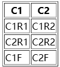

# **HTML学习笔记**

### HTML基本骨架


| 标签  | 说明               |
| ----- | ------------------ |
| html  | 定义整个html文档   |
| head  | 定义元文件等信息   |
| body  | 定义整个文档的主体 |
| title | 设置文档标题       |

```html
<!DOCTYPE html>
<html lang="en">
<head>
    <meta charset="UTF-8">
    <meta name="viewport" content="width=device-width, initial-scale=1.0">
    <title>a_title</title>
</head>
<body>

</body>
</html>
```

## 文本标签

### 标签的写法

```html
<p>中间内容</p>
<h1>中间内容</h1>
```


| 标签   | 说明                     |
| ------ | ------------------------ |
| p      | 段落                     |
| h1     | 一级标题，最重要的标题   |
| h2     | 二级标题                 |
| ..h6   | 六级标题，最不重要的标题 |
| strong | 加粗                     |
| em     | 倾斜                     |
| i      | 倾斜                     |
| ins    | 下划线                   |
| u      | 下划线                   |
| del    | 删除线                   |
| s      | 删除线                   |

> 可以使用/br标签进行换行

## 图片

图像属性


| 标签         | 说明             |
| ------------ | ---------------- |
| alt          | 不显示图片时说明 |
| title        | 鼠标触摸后的说明 |
| width/height | 定义长宽         |

## 表格

### 表格基础语法

#### 语法
表格为table标签，行为tr(tablerow)标签，每行可包含多个由td(tabledata)标签定义的单元格,单元格可包含文本，图片，视频，表格，列表等元素。

表格头可使用thead标签定义，表格尾可使用tfoot标签定义。
#### 示例
```html
<table border="1"> 
    <thead>
        <tr>
            <th>C1</th>
            <th>C2</th>
        </tr>
    </thead>
    <tbody>
        <tr>
            <td>C1R1</td>
            <td>C1R2</td>
        </tr>
        <tr>
            <td>C2R1</td>
            <td>C2R2</td>
        </tr>
    </tbody>
    <tfoot>
        <tr>
            <td>C1F</td>
            <td>C2F</td>
        </tr>
    </tfoot>
</table>
```    

  > border:边框厚度

#### 效果


## 表格合并

#### 语法
rowspan属性设定单元高度(最上优先) \
colspan属性设定单元宽度(最左优先)

#### 示例
```html
<table border="1"> 
    <tbody>
        <tr>
            <td rowspan="2">C1R1</td>
            <td>C1R2</td>
        </tr>
        <tr>
            <td>C2R2</td>
        </tr>
    </tbody>
</table>
```
#### 效果
