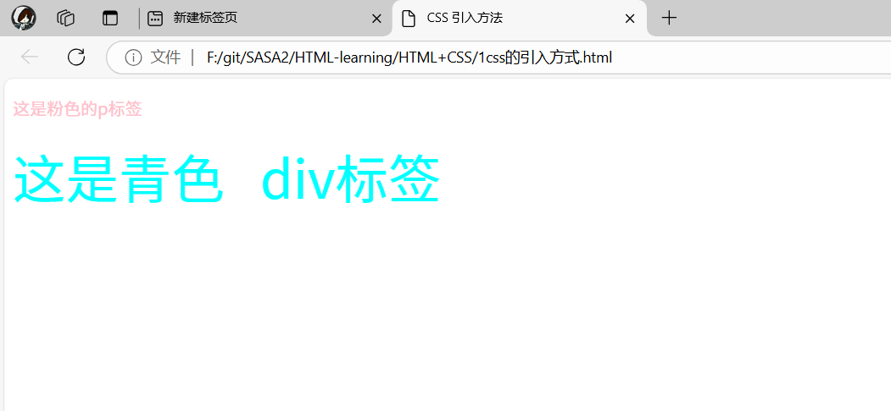
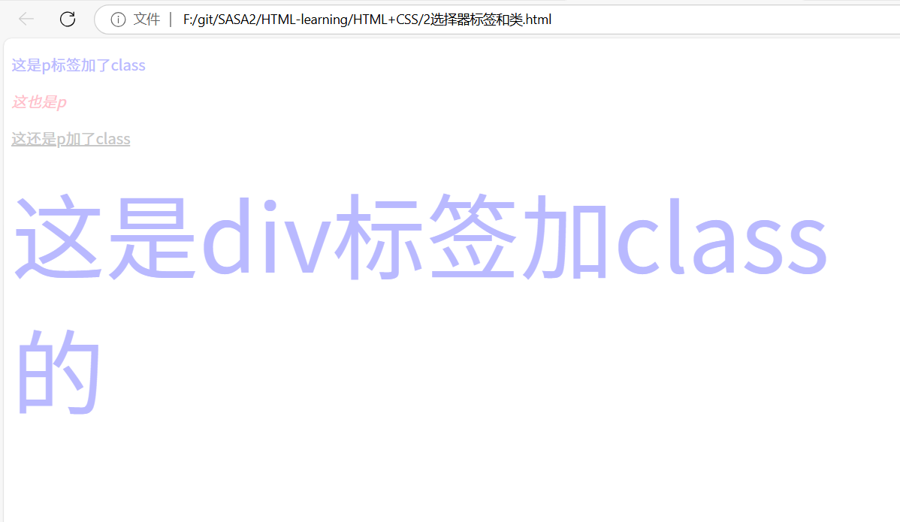

## CSS的引入方式

### 1. 外部样式表

使用 `<link>` 标签引入外部样式表。`rel` 属性表示关系，`href` 属性指定样式表文件的路径。

```html
<!DOCTYPE html>
<html lang="en">
<head>
    <meta charset="UTF-8">
    <meta name="viewport" content="width=device-width, initial-scale=1.0">
    <title>CSS 引入方法</title>
    <!-- link引入外部样式表；rel:关系，样式表 -->
    <link rel="stylesheet" href="./1.css">
</head>
<body>
    <p>这是粉色的p标签</p>
</body>
</html>
```

### 2. 内部样式表

在 `<head>` 标签内使用 `<style>` 标签定义样式。

```html
<!DOCTYPE html>
<html lang="en">
<head>
    <meta charset="UTF-8">
    <meta name="viewport" content="width=device-width, initial-scale=1.0">
    <title>CSS 引入方法</title>
    <style>
        p {
            color: pink;
        }
    </style>
</head>
<body>
    <p>这是粉色的p标签</p>
</body>
</html>
```

### 3. 行内样式

直接在HTML标签内使用 `style` 属性定义样式。

```html
<!DOCTYPE html>
<html lang="en">
<head>
    <meta charset="UTF-8">
    <meta name="viewport" content="width=device-width, initial-scale=1.0">
    <title>CSS 引入方法</title>
</head>
<body>
    <p style="color: pink;">这是粉色的p标签</p>
    <div style="color: aqua; font-size: 50px;">这是青色的div标签</div>
</body>
</html>
```


## 选择器、标签和类

### 1. 标签选择器

标签选择器用于选中所有同名标签，并应用相同的样式。

```html
<!DOCTYPE html>
<html lang="en">
<head>
    <meta charset="UTF-8">
    <meta name="viewport" content="width=device-width, initial-scale=1.0">
    <title>标签选择器</title>
    <style>
        /* 选中所有 <p> 标签并设置颜色为粉色 */
        p {
            color: pink;
        }
    </style>
</head>
<body>
    <p>这是一个段落</p>
    <p>这是另一个段落</p>
</body>
</html>
```

### 2. 类选择器

类选择器用于选中具有特定类名的元素，可以应用于多个标签。一个标签也可以使用多个类名，类名之间用空格隔开。

```html
<!DOCTYPE html>
<html lang="en">
<head>
    <meta charset="UTF-8">
    <meta name="viewport" content="width=device-width, initial-scale=1.0">
    <title>类选择器</title>
    <style>
        /* 定义类选择器 */
        .white {
            color: rgb(199, 199, 199);
        }
        .blue {
            color: rgb(185, 185, 255);
        }
        .size {
            font-size: 100px;
        }
    </style>
</head>
<body>
    <p class="blue">这是一个带有 blue 类的段落</p>
    <p><em>这是一个普通的段落</em></p>
    <p class="white"><ins>这是一个带有 white 类的段落</ins></p>
    <div class="blue size">这是一个带有 blue 和 size 类的 div 标签</div>
</body>
</html>
```

### 3. 多个类选择器

一个类选择器可以应用于多个标签，一个标签也可以使用多个类选择器，类名之间用空格隔开。

```html
<!DOCTYPE html>
<html lang="en">
<head>
    <meta charset="UTF-8">
    <meta name="viewport" content="width=device-width, initial-scale=1.0">
    <title>多个类选择器</title>
    <style>
        .blue {
            color: rgb(185, 185, 255);
        }
        .size {
            font-size: 100px;
        }
    </style>
</head>
<body>
    <div class="blue size">这是一个带有 blue 和 size 类的 div 标签</div>
</body>
</html>
```


## id选择器

### 1. 使用 `id` 选择器

`id` 选择器用于选中具有特定 `id` 属性的元素。`id` 选择器在CSS中使用 `#` 符号。

```css

        /* id选择器用# */
        #red {
            color: red;
        }
   
```

- `#red` 选择器将 `id` 为 `red` 的元素的文本颜色设置为红色。
- `id` 属性在HTML文档中应该是唯一的，每个 `id` 只能在文档中使用一次。

## 通配符选择器

### 1. 使用通配符选择器

通配符选择器 `*` 用于选中页面中的所有元素，并应用相同的样式。

```css
        * {
            color: brown;
        }
```

- `*` 选择器将页面中所有元素的文本颜色设置为棕色。
- 通配符选择器非常强大，但不应该滥用，因为它会影响页面中的所有元素，会导致意外的样式覆盖。

## 画盒子

### 1. HTML结构

使用 `div` 标签创建不同颜色的盒子。

```css
        .blue {
            width: 500px;
            height: 50px;
            background-color: rgb(176, 216, 249);
        }
        .pink {
            width: 500px;
            height: 50px;
            background-color: rgb(252, 208, 215);
        }
        .white {
            width: 500px;
            height: 50px;
            background-color: white;
        }
```

### 2. CSS样式

使用类选择器为每个盒子设置宽度、高度和背景颜色。

- `.blue` 类设置背景颜色为蓝色。
- `.pink` 类设置背景颜色为粉色。
- `.white` 类设置背景颜色为白色。
