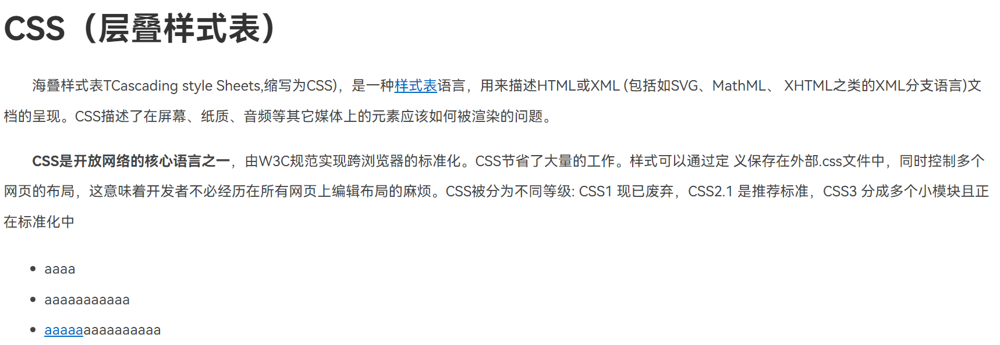

## 字体和文本属性

| 标签            | 说明         |
| --------------- | ------------ |
| font-size       | 文字大小     |
| font-weight     | 字体粗细     |
| font-style      | 字体倾斜     |
| line-height     | 行高         |
| font-family     | 字体族       |
| font            | 字体复合属性 |
| text-indent     | 文本缩进     |
| text-align      | 文本对齐     |
| text-decoration | 修饰线       |
| color           | 颜色         |

### font-size

文字的大小：可以使用像素（px）、点（pt）、百分比（%）等单位。

```css
p {
  font-size: 16px;
}
```

### font-weight

设置文字的粗细：常用的值有 `normal`（正常）、`bold`（加粗），以及从 `100`到 `900`的数值。

```css
h1 {
  font-weight: bold;
}
```

### font-style

设置文字的倾斜程度：常用的值有 `normal`（正常）、`italic`（倾斜）和 `oblique`（倾斜但不同于 `italic`）。

```css
em {
  font-style: italic;
}
```

### line-height

行与行之间的距离：可以使用像素、百分比或者倍数。

```css
p {
  line-height: 1.5;
}
```

### font-family

指定字体族：可以指定多个字体，按顺序匹配使用。

```css
body {
  font-family: Arial, sans-serif;
}
```

### text-indent

文本的缩进：中文常用2em缩进两格

```css
p {
  text-indent: 2em;
}
```

### text-align

文本的对齐方式：常用的值有 `left`、`right`、`center`和 `justify`。

```css
h1 {
  text-align: center;
}
```

### text-decoration

添加修饰线：常用的值有 `none`（无）、`underline`（下划线）、`overline`（上划线）和 `line-through`（删除线）。

```css
a {
  text-decoration: underline;
}
```

### color

文字的颜色：可以使用颜色名称、十六进制值、RGB值等。

```css
h1 {
  color: #ff0000; /* 红色 */
}
```

### font

可以一次性设置所有字体相关属性，包括上文提到的 `font-style`、`font-weight`、`font-size`、`line-height`和 `font-family`。

```css
p {
  font: italic  bold 16px/30px Georgia, serif;
}
```

### 案例CSS层叠样式表：

```
<!DOCTYPE html>
<html lang="en">
<head>
    <meta charset="UTF-8">
    <meta name="viewport" content="width=device-width, initial-scale=1.0">
    <title>Document</title>
    <style>
        h1{
            color: #333;
        }
        p{
            text-indent: 2em;
            font-size: 14px;
            line-height: 30px;
            color: #444;
        }
        a{
            color: #0069c2;
        }
        li{
            font-size: 14px;
            color: #444;
            line-height: 30px;
        }
    </style>
</head>
<body>
    <h1>CSS（层叠样式表）</h1>
    <p>海叠样式表TCascading style Sheets,缩写为CSS)，是一种<a href="#">样式表</a>语言，用来描述HTML或XML (包括如SVG、MathML、 XHTML之类的XML分支语言)文档的呈现。CSS描述了在屏幕、纸质、音频等其它媒体上的元素应该如何被渲染的问题。</p>
    <p><strong>CSS是开放网络的核心语言之一</strong>，由W3C规范实现跨浏览器的标准化。CSS节省了大量的工作。样式可以通过定 义保存在外部.css文件中，同时控制多个网页的布局，这意味着开发者不必经历在所有网页上编辑布局的麻烦。CSS被分为不同等级: CSS1 现已废弃，CSS2.1 是推荐标准，CSS3 分成多个小模块且正在标准化中</p>
    <ul>
        <li>aaaa</li>
        <li>aaaaaaaaaaa</li>
        <li> <a href="#">aaaaa</a>aaaaaaaaaa</li>
    </ul>
</body>
</html>
```


