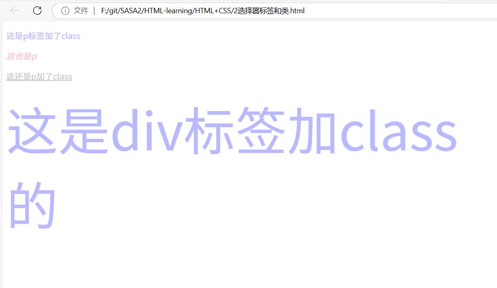

# HTML+CSS第二次学习笔记

## CSS的引入方式

### 1. 外部样式表

使用 `<link>` 标签引入外部样式表。`rel` 属性表示关系，`href` 属性指定样式表文件的路径。

```html
<!DOCTYPE html>
<html lang="en">
<head>
    <meta charset="UTF-8">
    <meta name="viewport" content="width=device-width, initial-scale=1.0">
    <title>CSS 引入方法</title>
    <!-- link引入外部样式表；rel:关系，样式表 -->
    <link rel="stylesheet" href="./1.css">
</head>
<body>
    <p>这是粉色的p标签</p>
</body>
</html>
```

### 2. 内部样式表

在 `<head>` 标签内使用 `<style>` 标签定义样式。

```html
<!DOCTYPE html>
<html lang="en">
<head>
    <meta charset="UTF-8">
    <meta name="viewport" content="width=device-width, initial-scale=1.0">
    <title>CSS 引入方法</title>
    <style>
        p {
            color: pink;
        }
    </style>
</head>
<body>
    <p>这是粉色的p标签</p>
</body>
</html>
```

### 3. 行内样式

直接在HTML标签内使用 `style` 属性定义样式。

```html
<!DOCTYPE html>
<html lang="en">
<head>
    <meta charset="UTF-8">
    <meta name="viewport" content="width=device-width, initial-scale=1.0">
    <title>CSS 引入方法</title>
</head>
<body>
    <p style="color: pink;">这是粉色的p标签</p>
    <div style="color: aqua; font-size: 50px;">这是青色的div标签</div>
</body>
</html>
```


## 选择器、标签和类

### 1. 标签选择器

标签选择器用于选中所有同名标签，并应用相同的样式。

```html
<!DOCTYPE html>
<html lang="en">
<head>
    <meta charset="UTF-8">
    <meta name="viewport" content="width=device-width, initial-scale=1.0">
    <title>标签选择器</title>
    <style>
        /* 选中所有 <p> 标签并设置颜色为粉色 */
        p {
            color: pink;
        }
    </style>
</head>
<body>
    <p>这是一个段落</p>
    <p>这是另一个段落</p>
</body>
</html>
```

### 2. 类选择器

类选择器用于选中具有特定类名的元素，可以应用于多个标签。一个标签也可以使用多个类名，类名之间用空格隔开。

```html
<!DOCTYPE html>
<html lang="en">
<head>
    <meta charset="UTF-8">
    <meta name="viewport" content="width=device-width, initial-scale=1.0">
    <title>类选择器</title>
    <style>
        /* 定义类选择器 */
        .white {
            color: rgb(199, 199, 199);
        }
        .blue {
            color: rgb(185, 185, 255);
        }
        .size {
            font-size: 100px;
        }
    </style>
</head>
<body>
    <p class="blue">这是一个带有 blue 类的段落</p>
    <p><em>这是一个普通的段落</em></p>
    <p class="white"><ins>这是一个带有 white 类的段落</ins></p>
    <div class="blue size">这是一个带有 blue 和 size 类的 div 标签</div>
</body>
</html>
```

### 3. 多个类选择器

一个类选择器可以应用于多个标签，一个标签也可以使用多个类选择器，类名之间用空格隔开。

```html
<!DOCTYPE html>
<html lang="en">
<head>
    <meta charset="UTF-8">
    <meta name="viewport" content="width=device-width, initial-scale=1.0">
    <title>多个类选择器</title>
    <style>
        .blue {
            color: rgb(185, 185, 255);
        }
        .size {
            font-size: 100px;
        }
    </style>
</head>
<body>
    <div class="blue size">这是一个带有 blue 和 size 类的 div 标签</div>
</body>
</html>
```



## id选择器

### 1. 使用 `id` 选择器

`id` 选择器用于选中具有特定 `id` 属性的元素。`id` 选择器在CSS中使用 `#` 符号。

```css

        /* id选择器用# */
        #red {
            color: red;
        }
   
```

- `#red` 选择器将 `id` 为 `red` 的元素的文本颜色设置为红色。
- `id` 属性在HTML文档中应该是唯一的，每个 `id` 只能在文档中使用一次。

## 通配符选择器

### 1. 使用通配符选择器

通配符选择器 `*` 用于选中页面中的所有元素，并应用相同的样式。

```css
        * {
            color: brown;
        }
```

- `*` 选择器将页面中所有元素的文本颜色设置为棕色。
- 通配符选择器会影响页面中的所有元素，会导致意外的样式覆盖。

## 画盒子

### 1. HTML结构

使用 `div` 标签创建不同颜色的盒子。

```css
        .blue {
            width: 500px;
            height: 50px;
            background-color: rgb(176, 216, 249);
        }
        .pink {
            width: 500px;
            height: 50px;
            background-color: rgb(252, 208, 215);
        }
        .white {
            width: 500px;
            height: 50px;
            background-color: white;
        }
```

### 2. CSS样式

使用类选择器为每个盒子设置宽度、高度和背景颜色。

- `.blue` 类设置背景颜色为蓝色。
- `.pink` 类设置背景颜色为粉色。
- `.white` 类设置背景颜色为白色。


## 字体和文本属性

| 标签            | 说明         |

| --------------- | ------------ |

| font-size       | 文字大小     |

| font-weight     | 字体粗细     |

| font-style      | 字体倾斜     |

| line-height     | 行高         |

| font-family     | 字体族       |

| font            | 字体复合属性 |

| text-indent     | 文本缩进     |

| text-align      | 文本对齐     |

| text-decoration | 修饰线       |

| color           | 颜色         |

### font-size

文字的大小：可以使用像素（px）、点（pt）、百分比（%）等单位。

```css

p {

  font-size: 16px;

}

```

### font-weight

设置文字的粗细：常用的值有 `normal`（正常）、`bold`（加粗），以及从 `100`到 `900`的数值。

```css

h1 {

  font-weight: bold;

}

```

### font-style

设置文字的倾斜程度：常用的值有 `normal`（正常）、`italic`（倾斜）和 `oblique`（倾斜但不同于 `italic`）。

```css

em {

  font-style: italic;

}

```

### line-height

行与行之间的距离：可以使用像素、百分比或者倍数。

```css

p {

  line-height: 1.5;

}

```

### font-family

指定字体族：可以指定多个字体，按顺序匹配使用。

```css

body {

  font-family: Arial,sans-serif;

}

```

### text-indent

文本的缩进：中文常用2em缩进两格

```css

p {

  text-indent: 2em;

}

```

### text-align

文本的对齐方式：常用的值有 `left`、`right`、`center`和 `justify`。

```css

h1 {

  text-align: center;

}

```

### text-decoration

添加修饰线：常用的值有 `none`（无）、`underline`（下划线）、`overline`（上划线）和 `line-through`（删除线）。

```css

a {

  text-decoration: underline;

}

```

### color

文字的颜色：可以使用颜色名称、十六进制值、RGB值等。

```css

h1 {

  color: #ff0000; /* 红色 */

}

```

### font

可以一次性设置所有字体相关属性，包括上文提到的 `font-style`、`font-weight`、`font-size`、`line-height`和 `font-family`。

```css

p {

  font: italic  bold16px/30pxGeorgia,serif;

}

```

### 案例CSS层叠样式表：

```

<!DOCTYPE html>

<html lang="en">

<head>

    <meta charset="UTF-8">

    <meta name="viewport" content="width=device-width, initial-scale=1.0">

    <title>Document</title>

    <style>

        h1{

            color: #333;

        }

        p{

            text-indent: 2em;

            font-size: 14px;

            line-height: 30px;

            color: #444;

        }

        a{

            color: #0069c2;

        }

        li{

            font-size: 14px;

            color: #444;

            line-height: 30px;

        }

    </style>

</head>

<body>

    <h1>CSS（层叠样式表）</h1>

    <p>海叠样式表TCascading style Sheets,缩写为CSS)，是一种<a href="#">样式表</a>语言，用来描述HTML或XML (包括如SVG、MathML、 XHTML之类的XML分支语言)文档的呈现。CSS描述了在屏幕、纸质、音频等其它媒体上的元素应该如何被渲染的问题。</p>

    <p><strong>CSS是开放网络的核心语言之一</strong>，由W3C规范实现跨浏览器的标准化。CSS节省了大量的工作。样式可以通过定 义保存在外部.css文件中，同时控制多个网页的布局，这意味着开发者不必经历在所有网页上编辑布局的麻烦。CSS被分为不同等级: CSS1 现已废弃，CSS2.1 是推荐标准，CSS3 分成多个小模块且正在标准化中</p>

    <ul>

        <li>aaaa</li>

        <li>aaaaaaaaaaa</li>

        <li> <a href="#">aaaaa</a>aaaaaaaaaa</li>

    </ul>

</body>

</html>

```


